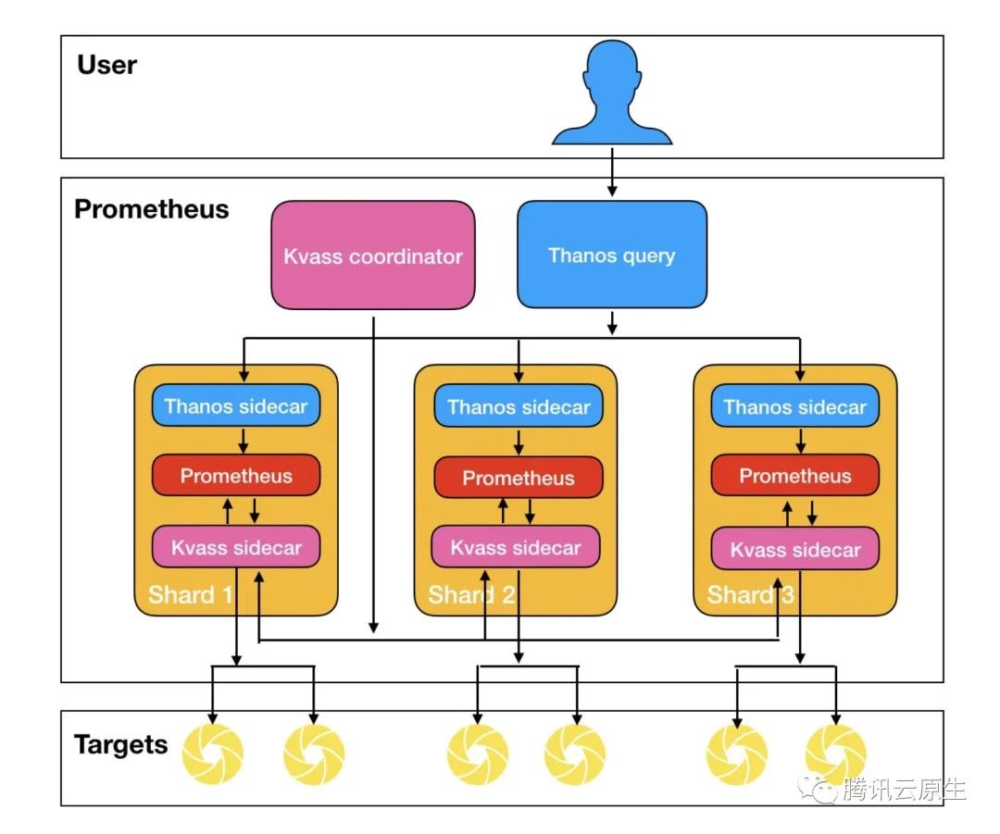

{}

## 概述

继上一篇 [Thanos 部署与实践](../../202004/build-cloud-native-large-scale-distributed-monitoring-system-3/) 发布半年多之后，随着技术的发展，本系列又迎来了一次更新。本文将介绍如何结合 Kvass 与 Thanos，来更好的实现大规模容器集群场景下的监控。

## 有 Thanos 不够吗 ?
有同学可能会问，Thanos 不就是为了解决 Prometheus 的分布式问题么，有了 Thanos 不就可以实现大规模的 Prometheus 监控了吗？为什么还需要个 Kvass？
Thanos 解决了 Prometheus 的分布式存储与查询的问题，但没有解决 Prometheus 分布式采集的问题，如果采集的任务和数据过多，还是会使 Prometheus 达到的瓶颈，不过对于这个问题，我们在系列的第一篇 [大规模场景下 Prometheus 的优化手段](../../202003/build-cloud-native-large-scale-distributed-monitoring-system-1) 中就讲了一些优化方法:

1. 从服务维度拆分采集任务到不同 Prometheus 实例。
2. 使用 Prometheus 自带的 hashmod 对采集任务做分片。

但是，这些优化方法还是存在一些缺点:
1. 配置繁琐，每个 Prometheus 实例的采集配置都需要单独配。
2. 需要提前对数据规模做预估才好配置。
3. 不同 Prometheus 实例采集任务不同，负载很可能不太均衡，控制不好的话仍然可能存在部分实例负载过高的可能。
4. 如需对 Prometheus 进行扩缩容，需要手动调整，无法做到自动扩缩容。

Kvass 就是为了解决这些问题而生，也是本文的重点。

## 什么是 Kvass ?
Kvass 项目是腾讯云开源的轻量级 Prometheus 横向扩缩容方案，其巧妙的将服务发现与采集过程分离，并用 Sidecar 动态给 Prometheus 生成配置文件，从而达到无需手工配置就能实现不同 Prometheus 采集不同任务的效果，并且能够将采集任务进行负载均衡，以避免部分 Prometheus 实例负载过高，即使负载高了也可以自动扩容，再配合 Thanos 的全局视图，就可以轻松构建只使用一份配置文件的超大规模集群监控系统。下面是 Kvass+Thanos 的架构图:



更多关于 Kvass 的详细介绍，请参考 [如何用 Prometheus 监控十万 container 的 Kubernetes 集群](https://mp.weixin.qq.com/s/P3F1grbVpb7LF2hcxYNOcg) ，文章中详细介绍了原理和使用效果。

## 部署实践

### 部署准备

首先下载 Kvass 的 repo 并进入 examples 目录:

``` bash
git clone https://github.com/tkestack/kvass.git
cd kvass/examples
```

在部署 Kvass 之前我们需要有服务暴露指标以便采集，我们提供了一个 metrics 数据生成器，可以指定生成一定数量的 series，在本例子中，我们将部署 6 个 metrics 生成器副本，每个会生成 10045 series，将其一键部署到集群:

``` bash
kubectl create -f  metrics.yaml
```

### 部署 Kvass

接着我们来部署 Kvass:

``` bash
kubectl create -f kvass-rbac.yaml # Kvass 所需的 RBAC 配置
kubectl create -f config.yaml # Prometheus 配置文件
kubectl create -f coordinator.yaml # Kvass coordinator 部署配置
```

其中，`config.yaml` 的 Prometheus 配置文件，配了对刚才部署的 metrics 生成器的采集:

``` yaml
global:
  scrape_interval: 15s
  evaluation_interval: 15s
  external_labels:
    cluster: custom
scrape_configs:
- job_name: 'metrics-test'
  kubernetes_sd_configs:
    - role: pod
  relabel_configs:
  - source_labels: [__meta_kubernetes_pod_label_app_kubernetes_io_name]
    regex: metrics
    action: keep
  - source_labels: [__meta_kubernetes_pod_ip]
    action: replace
    regex: (.*)
    replacement: ${1}:9091
    target_label: __address__
  - source_labels:
    - __meta_kubernetes_pod_name
    target_label: pod
```

`coordinator.yaml` 我们给 Coordinator 的启动参数中设置每个分片的最大 head series 数目不超过 30000:

> --shard.max-series=30000

然后部署 Prometheus 实例(包含 Thanos Sidecar 与 Kvass Sidecar)，一开始可以只需要单个副本:

``` bash
kubectl create -f prometheus-rep-0.yaml
```

> 如果需要将数据存储到对象存储，请参考上一篇 [Thanos 部署与实践](https://imroc.cc/posts/build-cloud-native-large-scale-distributed-monitoring-system-3/) 对 Thanos Sidecar 的配置进行修改。

### 部署 thanos-query

为了得到全局数据，我们需要部署一个 thanos-query:

``` bash
kubectl create -f thanos-query.yaml
```

根据上述计算，监控目标总计 6  个 target, 60270 series，根据我们设置每个分片不能超过 30000 series，则预期需要 3 个分片。我们发现，Coordinator 成功将 StatefulSet 的副本数改成了 3。

``` bash
$ kubectl get pods
NAME                                READY   STATUS    RESTARTS   AGE
kvass-coordinator-c68f445f6-g9q5z   2/2     Running   0          64s
metrics-5876dccf65-5cncw            1/1     Running   0          75s
metrics-5876dccf65-6tw4b            1/1     Running   0          75s
metrics-5876dccf65-dzj2c            1/1     Running   0          75s
metrics-5876dccf65-gz9qd            1/1     Running   0          75s
metrics-5876dccf65-r25db            1/1     Running   0          75s
metrics-5876dccf65-tdqd7            1/1     Running   0          75s
prometheus-rep-0-0                  3/3     Running   0          54s
prometheus-rep-0-1                  3/3     Running   0          45s
prometheus-rep-0-2                  3/3     Running   0          45s
thanos-query-69b9cb857-d2b45        1/1     Running   0          49s
```

我们再通过 thanos-query 来查看全局数据，发现数据是完整的(其中 metrics0 为指标生成器生成的指标名):


如果需要用 Grafana 面板查看监控数据，可以添加 thanos-query 地址作为 Prometheus 数据源: `http://thanos-query.default.svc.cluster.local:9090`。

## 小结

本文介绍了如何结合 Kvass 与 Thanos 来实现超大规模容器集群的监控，如果你使用了腾讯云容器服务，可以直接使用运维中心下的 `云原生监控` 服务，此服务就是基于 Kvass 构建的产品。

